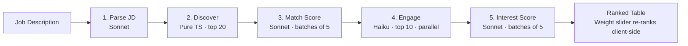

# Deccan AI — Talent Scouting & Engagement Agent

Find candidates who are a good fit *and* actually want to talk to you.

## The Problem

Most recruiting tools return candidates ranked by skill match. But skill match alone misses half the picture: a 95% match who's happy at their current job and ignores your message is less valuable than a 75% match who's actively looking and asks three specific questions about your tech stack. Deccan AI surfaces both signals — fit and genuine interest — and lets you weight them yourself.

## How It Works

Five stages run in sequence every time you submit a job description:

1. **Parse** — Claude (Sonnet) extracts role, required skills, seniority, and domain from your JD
2. **Discover** — Pure keyword scoring narrows 60 candidates down to the top 20 without any API call
3. **Match** — Claude scores each of the top 20 on skill fit (0–100), with strengths and gaps
4. **Engage** — Claude (Haiku, cheap) simulates a recruiter outreach conversation with each of the top 10, using a persona driven by the candidate's life state (actively looking, passive, happy, etc.)
5. **Interest** — Claude (Sonnet) reads each conversation and assigns an interest score (0–100) with signals: enthusiasm, specificity, questions asked, availability

The weight slider on the left panel re-ranks candidates instantly in your browser — no API call, no reload.

## Architecture



## Setup

```bash
git clone <repo>
cd deccan-ai
pnpm install
```

Create `.env.local`:
```
ANTHROPIC_API_KEY=sk-ant-...
USE_MOCK=true
```

If `data/candidates.json` is empty or missing:
```bash
pnpm seed   # ~$0.30, ~45 seconds — uses real API regardless of USE_MOCK
```

Start dev server:
```bash
pnpm dev
```

Open [http://localhost:3000](http://localhost:3000), pick a sample JD, click Find Candidates.

## Cost

| Mode | Per shortlist run |
|------|-------------------|
| `USE_MOCK=true` | $0.00 |
| `USE_MOCK=false` | ~$0.80 |

The `.cache/` directory stores real API responses keyed by input hash. Re-running the same JD costs $0 after the first time.

## Sample Inputs

- `data/sample-jds/backend-engineer.md` — Senior Backend Engineer, fintech, Go/Python, 5+ years
- `data/sample-jds/ml-engineer.md` — ML Engineer, AI startup, PyTorch, LLMs, RAG

## Tech Stack

- Next.js 14 App Router + TypeScript
- Tailwind CSS + shadcn/ui (base-ui primitives)
- `@anthropic-ai/sdk` — Sonnet for reasoning, Haiku for conversations
- Zod for all structured LLM outputs
- File-based response cache (`.cache/`)
- Vercel deployment

## Key Design Decisions

- **Two scores, not one** — Match score measures whether someone can do the job. Interest score measures whether they want to. Combining them avoids wasting recruiter time on unresponsive top-matches.
- **Haiku for conversations** — Simulating 4-turn conversations with Sonnet would cost ~5× more with no meaningful quality difference for engagement signals. Haiku handles persona roleplaying well at a fraction of the cost.
- **Keyword discovery over embeddings** — Embeddings require a vector DB or embedding API call. Pure keyword overlap gets you 80% of the signal for 0% of the infrastructure cost, which is the right trade for a 60-candidate dataset.
- **File cache** — Every real Claude call is cached to `.cache/` keyed by MD5 of the full request params. Iterating on UI is free. Running the same JD twice costs $0.

## Known Limitations

- Discovery uses keyword matching, not semantic search — "ML Engineer" won't surface a "Research Scientist" unless skills overlap
- Conversations are simulated, not real outreach — interest scores reflect persona fidelity, not actual candidate behavior
- No persistent storage — results live in browser memory until page refresh
- 60 candidates is a demo dataset; production would need a real talent database

## Development Notes

Built over one weekend using Claude Code as a pair programmer. Architecture, scoring logic, persona design, and prompt engineering are my own; Claude Code handled scaffolding and boilerplate.
